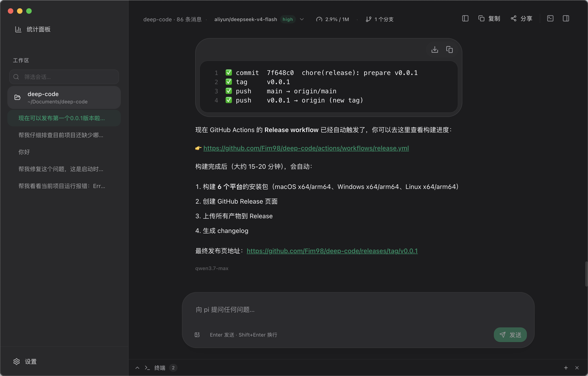
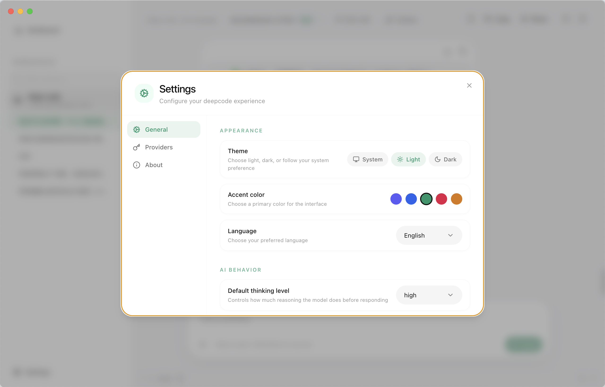
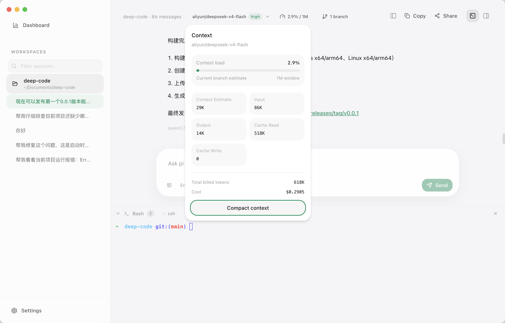

<div align="center">

# antcode

### Apple Music–style desktop client for the [pi](https://www.npmjs.com/package/@earendil-works/pi-coding-agent) coding agent

<p align="center">
  <a href="README.md">English</a> |
  <a href="README.zh.md">简体中文</a>
</p>

[](LICENSE)
[](package.json)
[](https://github.com/Fim98/deep-code/actions/workflows/ci.yml)
[](CONTRIBUTING.md)

[Report Bug](https://github.com/Fim98/deep-code/issues/new?template=bug_report.md) · [Request Feature](https://github.com/Fim98/deep-code/issues/new?template=feature_request.md)

</div>

<p align="center">
  
</p>

<p align="center">
   
</p>

---

## ✨ Features

- **Native Desktop Experience** — Built with Electron, designed to feel like a first-class macOS/Windows/Linux app
- **Apple Music–inspired UI** — Three-pane split view with translucent sidebar, spacious layout, and calm typography
- **Powered by pi** — Directly integrates `@earendil-works/pi-coding-agent` as an in-process library (no subprocess overhead)
- **Multi-workspace & Multi-session** — Manage multiple projects and concurrent AI conversations
- **Rich Chat Timeline** — Streaming responses, tool call cards, code blocks with syntax highlighting
- **Built-in Terminal** — Interactive xterm.js terminal with bash panel and diff viewer
- **Model & Provider Settings** — Configure API keys, switch providers, and manage models
- **File Tree & Preview** — Browse project files with syntax-highlighted preview
- **Multi-window Support** — Open multiple windows for parallel workflows
- **i18n** — Internationalization support with language switching
- **Opt-in Telemetry** — Privacy-respecting error reporting via Sentry

## 🏗 Architecture

```
Renderer (React 19 + Tailwind CSS v4)
       │  ipcRenderer.invoke("pi:rpc", sid, cmd)
       ▼
Electron Main Process
       │  dispatchRpc(session, cmd)         ← in-process function call
       ▼
@earendil-works/pi-coding-agent (AgentSession per session)
```

- **Main process** directly imports the pi SDK and manages a `Map<sessionId, AgentSession>`. No subprocess, no JSON-over-stdio — every renderer RPC call is a function call in the same V8 instance.
- **Multi-workspace, multi-session.** Each `AgentSession` carries its own `cwd` / `SessionManager` / event bus; shared `AuthStorage` and `ModelRegistry` are singletons.
- **IPC payloads reuse pi's `RpcCommand` / `RpcResponse` types** verbatim.
- **Renderer** is React 19 + Tailwind CSS v4 with Radix-based UI primitives. State managed with Zustand.

## 📦 Installation

### Prerequisites

- **Node.js** ≥ 22
- **npm** ≥ 10

### From Source

```bash
git clone https://github.com/Fim98/deep-code.git
cd deep-code
npm install
npm run dev
```

> 💡 The first install downloads the Electron binary (~100 MB). On a slow connection, set the mirror:
> ```bash
> ELECTRON_MIRROR=https://npmmirror.com/mirrors/electron/ npm install
> ```

### Pre-built Binaries

Download the latest release from [GitHub Releases](https://github.com/Fim98/deep-code/releases).

| Platform | Format |
|----------|--------|
| macOS (Intel & Apple Silicon) | `.dmg` / `.zip` |
| Windows (x64 & arm64) | `.exe` (NSIS installer) / `.zip` |
| Linux (x64 & arm64) | `.AppImage` / `.zip` |

## 🛠 Development

| Command | Description |
|---------|-------------|
| `npm run dev` | Start the app in development mode with hot reload |
| `npm run build` | Build for production |
| `npm run typecheck` | Run TypeScript type checking |
| `npm run lint` | Lint with Biome |
| `npm run format` | Format code with Biome |
| `npm run test` | Run all tests (node + web) |
| `npm run test:node` | Run main process tests |
| `npm run test:web` | Run renderer tests |
| `npm run package` | Build and package for current platform |
| `npm run package:mac` | Package for macOS (both architectures) |
| `npm run package:win` | Package for Windows (both architectures) |
| `npm run package:linux` | Package for Linux (both architectures) |

### Project Structure

```
deep-code/
├── src/
│   ├── main/          # Electron main process
│   ├── preload/       # Preload scripts (context bridge)
│   ├── renderer/      # React renderer (UI)
│   └── test/          # Test utilities
├── resources/         # App icons and static resources
├── .github/           # CI/CD workflows and issue templates
└── .husky/            # Git hooks (commitlint)
```

## 🚀 Roadmap

See [ROADMAP.md](ROADMAP.md) for the full feature roadmap and current progress.

### Completed Milestones

| Milestone | Scope | Status |
|-----------|-------|--------|
| M1 | Scaffold | ✅ |
| M2 | pi SDK bridge + IPC | ✅ |
| M3 | Apple Music three-pane layout | ✅ |
| M4 | Workspace management | ✅ |
| M5 | Session list | ✅ |
| M6 | Chat timeline | ✅ |
| M7 | Tool call cards | ✅ |
| M8 | Model + provider settings | ✅ |
| M9 | Bash panel + diff viewer | ✅ |
| M10 | Polish + context/cost bar | ✅ |

## 🤝 Contributing

We welcome contributions! Please see [CONTRIBUTING.md](CONTRIBUTING.md) for guidelines on how to get started.

### Contributors

Thanks to all the people who have contributed to antcode:

<!-- ALL-CONTRIBUTORS-LIST:START -->
<!-- ALL-CONTRIBUTORS-LIST:END -->

| | |
|---|---|
| <a href="https://github.com/Fim98"></a> | **[Fim98](https://github.com/Fim98)** — Creator & maintainer |

## 📄 License

This project is licensed under the [MIT License](LICENSE).

## 🙏 Acknowledgments

- [pi coding agent](https://www.npmjs.com/package/@earendil-works/pi-coding-agent) — The AI agent SDK that powers antcode
- [Electron](https://www.electronjs.org/) — Desktop application framework
- [React](https://react.dev/) — UI library
- [Tailwind CSS](https://tailwindcss.com/) — Utility-first CSS framework
- [Radix UI](https://www.radix-ui.com/) — Accessible UI primitives

---

<div align="center">

Made with ❤️ by [antcode contributors](https://github.com/Fim98/deep-code/graphs/contributors)

</div>
